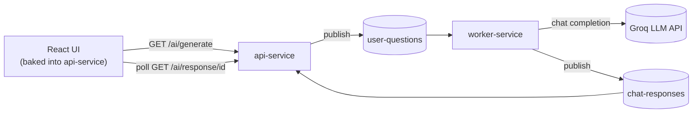

# AIn't
An async, Kafka-driven chat backend split into two independent Spring Boot microservices, fronted by a React UI, containerized end to end with Docker Compose.
Demo: https://thisaiintit.duckdns.org/ 

## Why I built this

This is a play project, not a production app. I built it to get hands-on with the pieces that actually show up in real distributed systems, on purpose, one at a time:

- **Microservices architecture.** Splitting a single "does everything" service into two independently deployable services (`api-service` and `worker-service`) that only talk to each other through a message queue, never directly.
- **Spring AI + LLM inference.** Wiring up Spring's AI abstractions against a real hosted model (Groq, via its OpenAI-compatible API) and treating async inference as a queue-backed job instead of a blocking HTTP call.
- **Cloud-style service architecture.** Docker Compose orchestration with real healthchecks and startup ordering, environment-driven config instead of hardcoded hosts, secrets kept out of the image.

## Architecture



**Request lifecycle:**
1. The React UI calls `GET /ai/generate?message=...` on `api-service`.
2. `api-service` generates a `requestId`, publishes `{requestId, message}` to the `user-questions` Kafka topic, and immediately returns `{status: "processing", requestId}`. It never blocks waiting on the LLM.
3. `worker-service` consumes `user-questions`, calls the LLM through Spring AI, and publishes `{requestId, answer, status}` to a second topic, `chat-responses`.
4. `api-service` has its own listener on `chat-responses` that stores the answer in memory, keyed by `requestId`.
5. The UI polls `GET /ai/response/{requestId}` every 2 seconds until it gets back `status: "complete"`.

The two Kafka topics are the entire contract between the services. `api-service` and `worker-service` share no code, no database, no direct network calls to each other. That's the actual point of the queue here, not just "it's what Kafka demos do": it lets `worker-service` (the slow, LLM-bound part) scale and fail independently of `api-service` (the fast, user-facing part). It's also what let me prove the services were actually decoupled once I split them: I watched `worker-service`'s logs show the publish and `api-service`'s logs show the listener picking it up, on two separate containers with no shared JVM left to fall back on.

## Tech stack

| Layer | Tech |
|---|---|
| Backend | Java 17, Spring Boot 4.0.5, Spring Kafka |
| AI inference | Spring AI, Groq (OpenAI-compatible API), `llama-3.1-8b-instant` |
| Messaging | Apache Kafka (Confluent images), ZooKeeper |
| Frontend | React 19 (Create React App), polling-based, no websockets |
| Infra | Docker Compose, multi-stage Docker builds |

## Running it locally

Requires Docker Desktop and a [Groq API key](https://console.groq.com) (free tier works fine).

```bash
cp .env.example .env
# edit .env and set GROQ_API_KEY=<your key>

docker compose up -d --build
```

Then open **http://localhost:8080**. The React UI is served directly by `api-service`.

Services come up in order (ZooKeeper, then Kafka, then api-service/worker-service) via Compose healthchecks, so there's no manual "wait for Kafka" step.

## Design decisions worth calling out

- **Two independent projects, not a Maven multi-module build.** `api-service/` and `worker-service/` each have their own `pom.xml` and `Dockerfile`, no shared parent module. Closer to how real separate services actually get built and deployed.
- **Service discovery via Docker Compose DNS, not Eureka.** With two services behind one broker, Compose's built-in service-name resolution (`kafka:29092`, etc.) plus an env-var-driven bootstrap-servers config does the whole job. Eureka would be solving a problem this project doesn't have yet, see Future Work.
- **In-memory result store, on purpose.** `api-service` keeps completed answers in a `ConcurrentHashMap`. Doesn't survive a restart, won't work if `api-service` ever scales past one replica. A known, deliberate limitation, not an oversight.

## Future work

- **Service registry integration (Eureka).** The current two-service setup doesn't need it, Compose DNS is enough. Worth adding once there are enough services (or enough dynamic scaling of `worker-service` replicas) that static service names stop being sufficient and clients need to discover instances at runtime instead.
- **Shared result store (Redis/Postgres)** so `api-service` can scale horizontally and answers survive a restart.
- **Reliability hardening.** A dead-letter topic for failed jobs, retry with backoff on the Kafka listeners, correlation IDs threaded through structured logs, basic metrics (job counts, failure counts, processing time).
- **Automated tests + CI.** Unit tests around message (de)serialization and listener logic, plus a GitHub Actions workflow to run them on every push.
